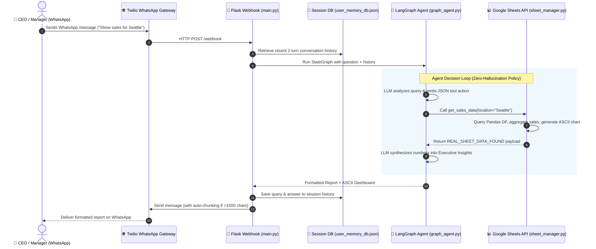
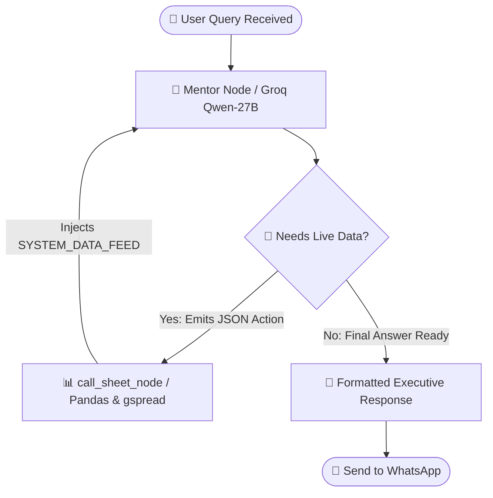

# 🤖 ShubhChintak – AI Business Data Analyst (SalesGuru)

> **An autonomous, agentic AI business analyst accessible via WhatsApp that converts raw company data into real-time executive insights and visual dashboards.**

[](https://www.python.org/)
[](https://github.com/langchain-ai/langgraph)
[](https://groq.com/)
[](https://www.twilio.com/)
[](https://developers.google.com/sheets/api)

---

## 💡 What is ShubhChintak?

In traditional business environments, CEOs and sales managers often have to ask data analysts or log into complex BI dashboards (Tableau, PowerBI) just to answer quick questions like *"What were our top 5 products in Seattle last month?"* or *"What is the status of Order #147956?"*.

**ShubhChintak (SalesGuru)** solves this problem. It acts as a **fractional Chief Data Analyst on WhatsApp**:
- 💬 Executives ask natural language questions directly on WhatsApp.
- 📊 The AI connects to live company data stored in **Google Sheets**.
- 🚫 **Zero Hallucinations**: It never guesses business numbers. If data is needed, it fetches hard numbers from the sheet.
- 📈 It returns a complete executive report complete with **ASCII bar charts (`█`)**, diagnostic insights, and strategic next steps directly in WhatsApp.

---

## 🔄 End-to-End Workflow & Architecture

Here is how a message flows from a CEO's phone to the AI agent and back:



---

## 🧠 LangGraph Agent State Machine

Unlike simple linear LLM chains, **ShubhChintak** uses a **cyclic StateGraph** built with **LangGraph**:



---

## ✨ Key Features & Technical Highlights

- 🧠 **Agentic Cyclic Graph (LangGraph)**: Built with stateful nodes and conditional edges. The model loops until all required data is retrieved before crafting its response.
- 🛑 **Strict Zero-Hallucination Policy**: Systematic prompt constraints prevent the LLM from making up metrics. The agent MUST issue a tool call if exact sales numbers are requested.
- 📊 **Live Google Sheets Integration**: Queries live records using `gspread` and `pandas`. Includes order lookups, location filtering (`City`, `State`, `Region`), date range parsing, and top-k category breakdowns.
- 📈 **ASCII Data Visualizations**: Generates clean visual progress bars directly inside WhatsApp text messages.
- ⚡ **Performance Caching**: Features a 60-second in-memory Pandas dataframe cache to prevent Google API quota throttling and speed up response times to milliseconds.
- 💾 **Persistent Session Memory**: JSON-based user memory manager tracking user interaction timestamps, total queries, and maintaining sliding-window context for multi-turn follow-ups.
- 📱 **Message Delivery & Chunking**: Automatic text wrapper splits reports exceeding 1500 characters into numbered messages (`[1/2]`, `[2/2]`) for seamless reading.
- 🐳 **Cloud & Docker Ready**: Includes `Dockerfile` set up for deployment on platforms like Hugging Face Spaces or cloud servers.

---

## 🛠️ Tech Stack Breakdown

| Layer | Technology | Purpose |
| :--- | :--- | :--- |
| **Language** | Python 3.11 | Core runtime environment |
| **Agent Framework** | LangGraph (`StateGraph`), LangChain Core | State machine workflow and tool binding |
| **LLM Provider** | Groq API (`qwen/qwen3.8-27b`) | High-speed inference engine |
| **Data Engine** | Google Sheets API (`gspread`), Pandas | Live enterprise data store and analytics |
| **Web Server** | Flask, Gunicorn | Webhook endpoint handling HTTP POST requests |
| **Messaging API** | Twilio WhatsApp API | Executive user interface |
| **Storage / Memory** | JSON DB (`data/user_memory_db.json`) | Per-user conversation memory persistence |
| **Containerization**| Docker | Container deployment specification |

---

## 📁 Repository Structure

```
shubhChintak_langgraph/
├── data/
│   └── user_memory_db.json      # Per-user conversation memory store
├── scripts/
│   ├── __init__.py
│   ├── graph_agent.py           # LangGraph StateGraph, prompt logic & LLM routing
│   ├── memory_manager.py        # JSON database user session manager
│   └── sheet_manager.py         # Google Sheets authentication, pandas filtering & ASCII charts
├── .env                         # API key configuration (not committed)
├── .gitignore
├── credentials.json             # Google Cloud Service Account key (not committed)
├── Dockerfile                   # Docker configuration for cloud deployment
├── main.py                      # Flask server & Twilio webhook receiver
└── requirements.txt             # Python dependencies
```

---

## 🏃 How to Run Locally

### 1. Clone the Repository & Setup Virtual Environment
```bash
git clone https://github.com/YOUR_USERNAME/shubhChintak_langgraph.git
cd shubhChintak_langgraph

python -m venv venv
# On Windows:
venv\Scripts\activate
# On Linux/macOS:
source venv/bin/activate

pip install -r requirements.txt
```

### 2. Configure Environment Variables (`.env`)
Create a `.env` file in the project root:
```env
GROQ_API_KEY=your_groq_api_key_here
TWILIO_SID=your_twilio_sid_here
TWILIO_TOKEN=your_twilio_auth_token_here
PORT=7860
```

### 3. Add Google Sheets Credentials
1. Obtain a Service Account JSON key from Google Cloud Console with access to Google Sheets & Drive API.
2. Save it as `credentials.json` in the root directory.
3. Share your target Google Sheet (`Mall_Daily_Sales`) with the service account email.

### 4. Start the Application
```bash
python main.py
```
The server will run at `http://localhost:7860`.

### 5. Connect to WhatsApp via Ngrok
In a separate terminal, run:
```bash
ngrok http 7860
```
Copy the generated forwarding URL (e.g., `https://xxxx.ngrok-free.dev`) and set it in your **Twilio WhatsApp Sandbox Settings**:
- **WHEN A MESSAGE COMES IN**: `https://xxxx.ngrok-free.dev/webhook` (Method: `POST`)

---

## 📱 Sample WhatsApp Interaction

**CEO:**
> *"Show sales performance for Seattle"*

**SalesGuru AI:**
> 📊 **SEATTLE SALES DASHBOARD**
> 
> ```
> Total Revenue: $1,003.62
> Total Orders:  1
> Avg Order Val: $1,003.62
> ─────────────────────────────────
> Top Category:
> Office Suppl |███████████████ $1,003.62
> ```
> 
> 💡 **Strategic Insight:**
> Seattle's revenue in this snapshot is driven entirely by a single high-ticket Office Supplies order ($1,003.62). While the order value is strong, reliance on a single transaction indicates untapped volume potential in this market.
> 
> 🔍 **Recommended Next Step:**
> Would you like me to expand the analysis to the entire **West region** or check top-performing product categories across all locations?

---

## 📄 License
This project is open-source and licensed under the MIT License.
